# LWF Project
This project aims to compare different pretrained model weights on the segmentation of linear features using the LWF dataset. This project uses the UNet implementation of TorchGeo and the provided model weights.
## How to use
1. write config in /oma24-proj/config/  e.g. TorchGeoUNet
2. write .sh in /oma24-proj/hpc_sh
3. e.g. sbatch path/to/oma24-proj/hpc_sh/submit_TorchGeoUNet_resnet50_tcd.sh

## 1. Deep Learning Pipeline Overview

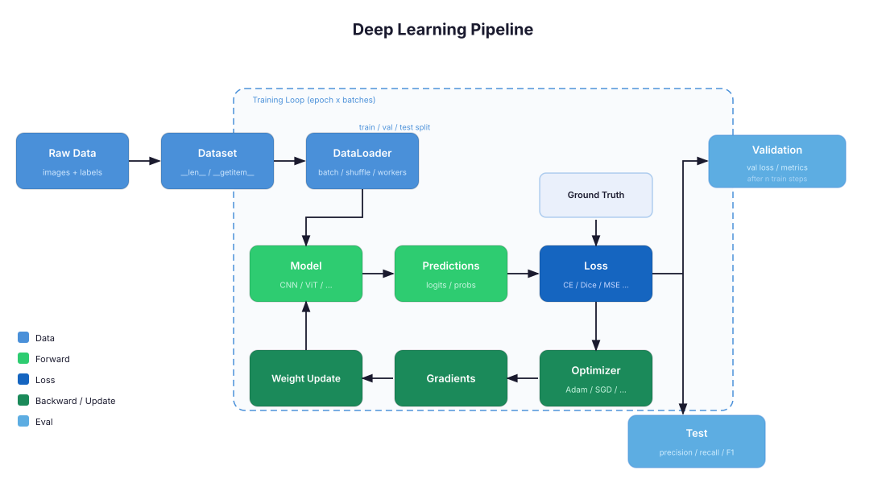

In general, Deep Learning starts with the given data having a certain shape or dimension and the problem we want to solve. Depending on our problem, we might want to do image segmentation, object detection or image classification. The type of problem and the nature of our data determines how our data is labeled, e.g. if it is a binary class problem or if instances might have multiple labels at once. We also must define a model architecture in respect to the input shape and the output we are looking for. In PyTorch we also implement a Dataset and a DataLoader.

A Dataset defines how a single sample is loaded and preprocessed. It implements two methods: `__len__` (total number of samples) and `__getitem__` (load and return one sample by index). This is also where transforms and data augmentation take place — random flips, rotations or colour jitter are applied inside `__getitem__` before the sample is returned to the model.

A DataLoader wraps the Dataset and handles batching, shuffling and parallel data loading. During training it shuffles the data each epoch and loads multiple samples in parallel (via `num_workers`) so the GPU is never waiting for data.
Before we can train our model, the data must be split into train, val and test splits, each becoming their own dataset wrapped by their own DataLoader.
Furthermore we have to define a loss function and the optimizer.
The loss function basically computes the error for each prediction-ground truth pair which is then propagated backwards through the models layers. The Dataloader groups the data to batches (e.g batch size 12 or 32) which are used in a single training step (forward + backward + optimizer.step()). The optimizer.step() function updates the models parameters (weights). The way the gradients are updated depends on the optimizer (e.g. Adam, SGD etc.) and the learning rate. When the model has seen all batches, one epoch is over. The validation data is only used after a certain number of training steps and is passed forward into the model and used to compute the validation loss in order to check if the model overfits. However, it does not influence the gradients. When the training is over, the test metrics can be computed ( test loss, precision, recall etc.)
## 2. Brief Problem Description
The general aim is to segment linear features from background and patchy vegetation.
The input data is a binary mask (0: background, 1: vegetation).
The labels are discrete masks (0: background, 1: linear vegetation, 2: patchy vegetation)
( the original data has some more classes but all remaining classes are remapped to "2" (patchy vegetation))
A small selection of labeled input data can be seen here:

## 3. Baseline Description

The baseline model is a **TorchGeo UNet** — a classic encoder-decoder network with skip connections. The encoder (ResNet34) progressively downsamples the image while extracting increasingly abstract features. The decoder reconstructs the image back to the original resolution, using skip connections to recover fine spatial details from the encoder. The network outputs one of three classes per pixel: background, linear vegetation, or patchy vegetation.

As the **baseline**, the model is trained *from scratch*, meaning all weights are randomly initialised and learned solely on the LWF dataset.

The **input** is a binary mask (0 = no vegetation, 1 = vegetation), repeated to 3 channels to match the ResNet34 encoder's expected input. The **output** is 3-class logits per pixel.

Since linear features (class 1) are rare, a **weighted Cross-Entropy loss** is used: background × 1, linear vegetation × 50, patchy vegetation × 5.

The following metrics are used for evaluating the models performances:
### Metrics

| Metric | Description |
|---|---|
| **Loss (CE)** | Weighted cross-entropy loss — the optimisation objective during training |
| **IoU per class** | Intersection over Union per class — how well the predicted mask overlaps with the ground truth |
| **Precision per class** | Fraction of pixels predicted as this class that are actually correct |
| **Recall per class** | Fraction of ground-truth pixels for this class that were correctly detected |
| **mAP@\[0.50:0.95\]** | Mean Average Precision at IoU thresholds from 0.50 to 0.95 (step 0.05) — evaluates segmentation quality across various IoU thresholds  |
| **Confusion matrix** | Absolute pixel counts and fractions for each true/predicted class pair  |
## 4. Motivation for Modification
In general models can profit from using pretrained weights which were generated on a large dataset. Pretrained weights can transfer learned features, which can improve the models performance and boost the training time. 
## 5. Implementation Description
This experiment did not need big adjustments in the pipeline. It uses the Unet_Weights class provided by TorchGeo. In /oma24-proj/config/TorchGeoUNet we can find three different config files using either no weights, the OAM_RGB_RESNET34_TCD weights or the OAM_RGB_RESNET50_TCD weights.  Both pretrained weights are used for tree segmentation in OpenAerialMap high-resolution aerial imagery. The models were trained on a mix of CC-BY and CC-BY-NC licensed aerial imagery. The only difference is that OAM_RGB_RESNET34_TCD uses a ResNet-34 backbone instead of ResNet-50. They can be found under https://huggingface.co/isaaccorley/unet_resnet50_oam_rgb_tcd and https://huggingface.co/isaaccorley/unet_resnet34_oam_rgb_tcd .
## 6. Results and Discussion

### **TorchGeo UNet — Scratch (ResNet34, no pretraining)**

#### Loss Curve
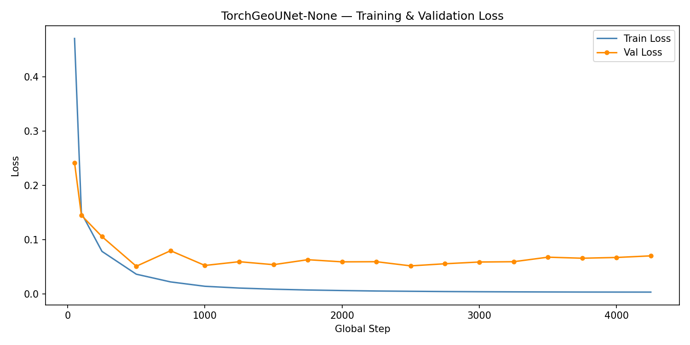

#### Precision & Recall
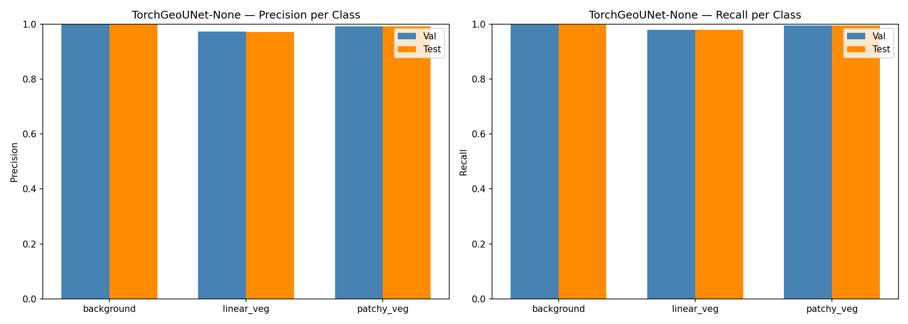

#### mAP@[0.50:0.95]
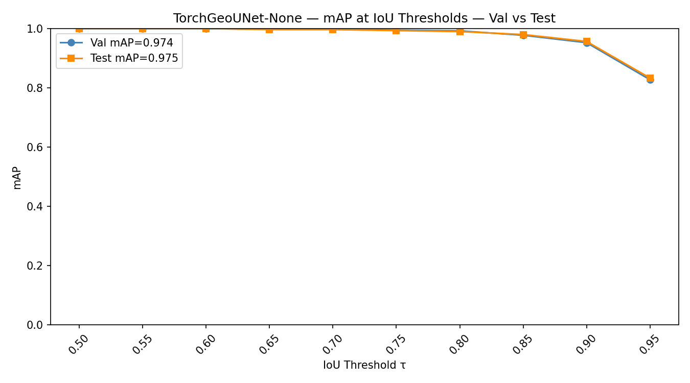

#### Confusion Matrix
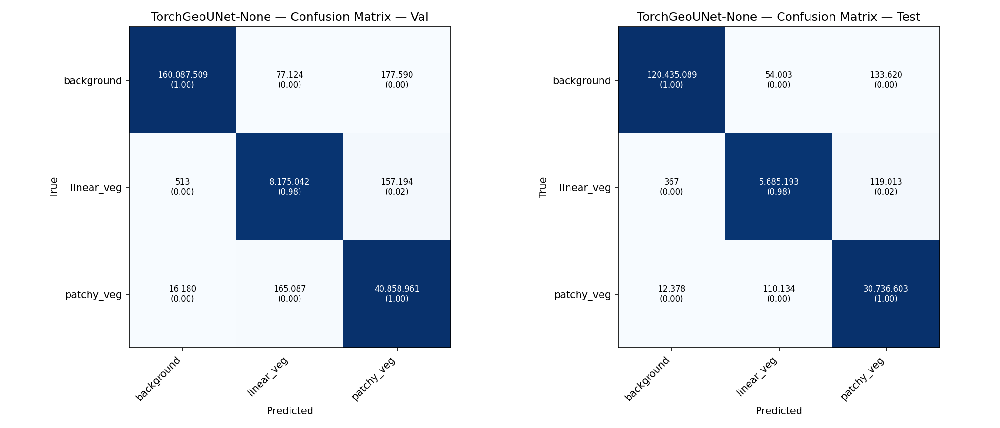

---

### **TorchGeo UNet — OAM_RGB_RESNET34_TCD (ResNet34, tree-canopy pretraining)**

#### Loss Curve
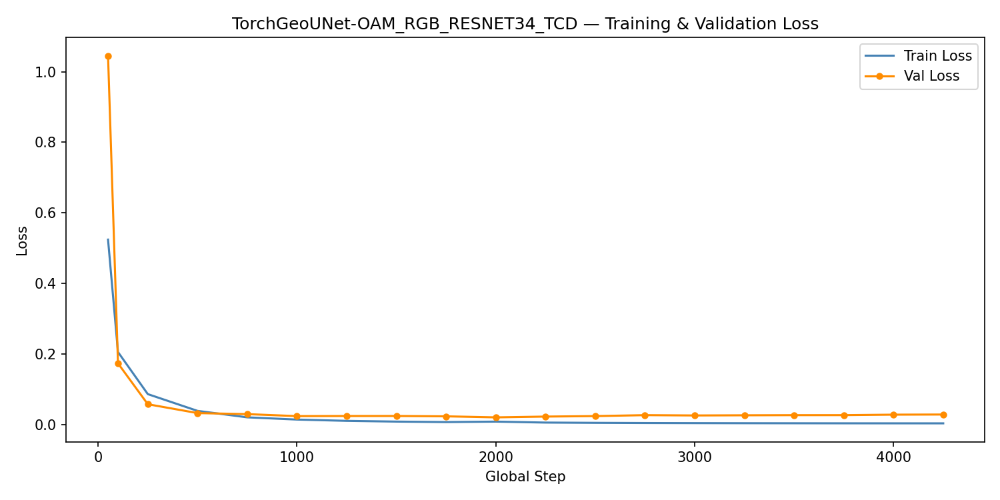

#### Precision & Recall
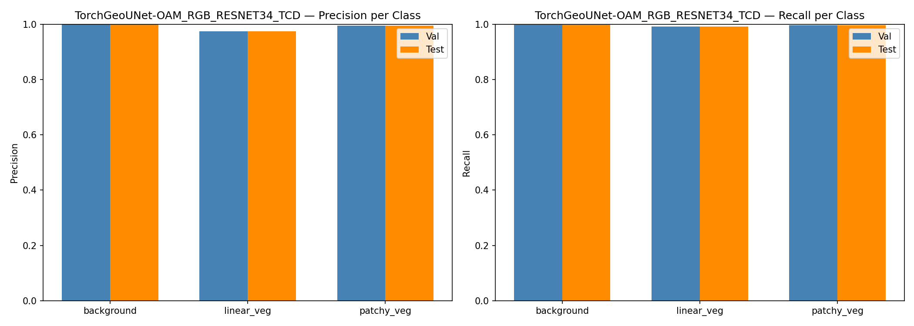

#### mAP@[0.50:0.95]
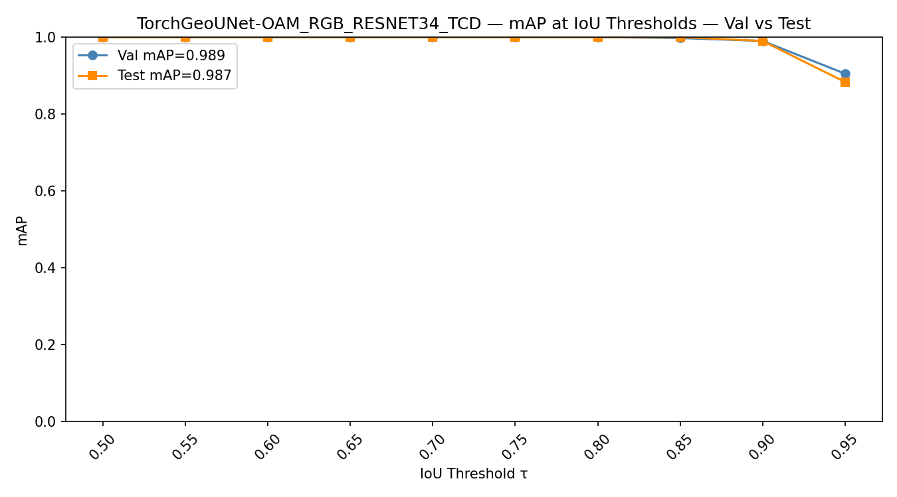

#### Confusion Matrix
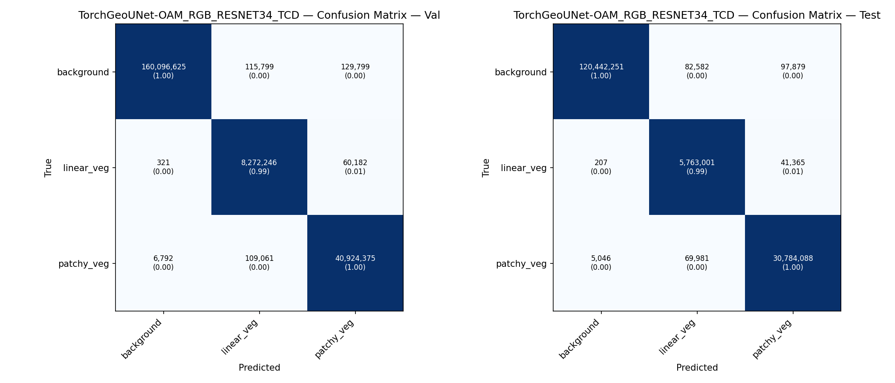

---

### **TorchGeo UNet — OAM_RGB_RESNET50_TCD (ResNet50, tree-canopy pretraining)**

#### Loss Curve
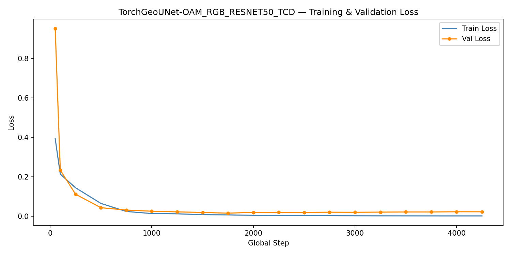

#### Precision & Recall
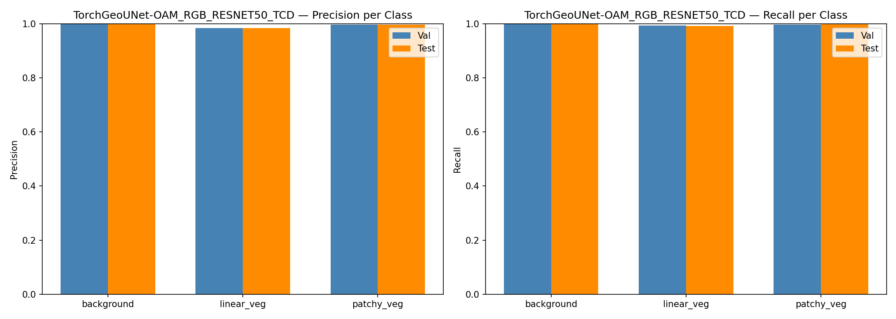

#### mAP@[0.50:0.95]
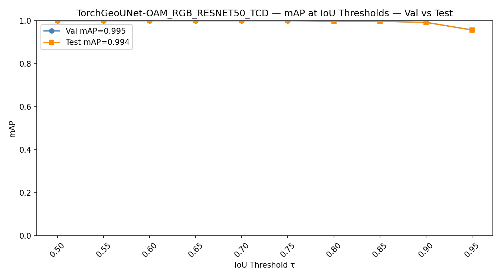

#### Confusion Matrix

### Discussion
When comparing the loss curves, it can be seen that using pretrained weights stabilizes the training and low loss values are reached earlier. However, the different scaling of the plots exaggerates this. Furthermore the drop in mAP is significantly higher for larger IoU thresholds when the model is trained from scratch. The pretraining leads to better performances with high IoU thresholds. Additionally the ResNet-50 backbone also performs better than the ResNet-34 based model.

---
Kjell Wundram